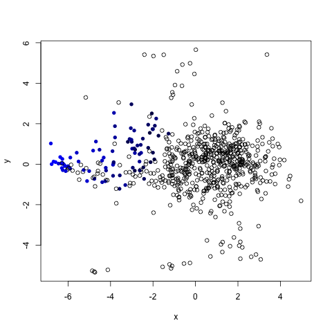

# MDS Modeling Tools #

This project provides several tools for creating and analyzing multidimensional
scaling (MDS) models.



## Overview ##

This project was created to assist modeling similarities between U.S.
universities, and contains tools to assist with three primary tasks:
* **Parsing data**
* **Creating an MDS model**
* **Analysing the model**

Data is filtered from an input `.csv` file, producing another `.csv` file with
only the columns specified in an `attributes.txt` file and the rows that
contain data for those columns. All values in this output will also be
normalized to have a mean of 0 and standard deviation of 1.

A 2D MDS model is then created, with both a wordcloud and unlabeled scatter
plot being produced alongn with plots of goodness-of-fit vs. different model
dimensions and Minkowski p-values. A `colors.csv` file can optionally be given
to color points in the unlabeled plot. A `ranks.txt` can also be used to
generate this file automatically based on an ordered ranking. 1D and 3D models
can also be created by editing `MDS.R`.

The `points.csv` output of the model can then be analyzed to determine the
correlation direction and magnitue for each direction for each dimension.
n-dimensional inputs are supported. The reuslts are then printed and saved to a
file, with the attribute ordered from most correlated to least for each
dimension.

## Running ##
To parse, run, and analyse everything from scratch, run the default make
target:
```
make
```

To include coloring based on a `ranks.txt` file, run:
```
make color
```
Programs can also be run separately:
* `python3 filter.py [data.csv] < [attributes.txt]`
* `python3 color.py`
* `Rscript MDS.R <colors.csv>`
* `python3 analyze.py < [attributes.txt]`

## Example Analysis Output ##

```
Analyzing lower 10% and upper 10%...
Dimension 1 Correlations:
    Attribute   Direction   - Interval Avg  + Interval Avg  Interval Diff
    =====================================================================================
    SATVRMID    NEGATIVE    211.530035      -127.492136     -339.022170
    SATWRMID    NEGATIVE    219.782428      -118.104871     -337.887299
    SATMTMID    NEGATIVE    213.415974      -122.312434     -335.728408
    C150_4      NEGATIVE    174.657065      -146.422081     -321.079147
    C100_4      NEGATIVE    175.511777      -127.241823     -302.753600
    COSTT4_A    NEGATIVE    159.308286      -89.135429      -248.443715
    ADM_RATE    POSITIVE    -192.254293     35.886583       228.140876
    UG25ABV     POSITIVE    -90.658550      113.408127      204.066676
    UGDS        NEGATIVE    18.264898       -37.383670      -55.648567
    UGDS_MEN    NEGATIVE    17.700480       -28.415548      -46.116027
    UGDS_WOMEN  POSITIVE    -17.700480      28.415548       46.116027
Dimension 2 Correlations:
    Attribute   Direction   - Interval Avg  + Interval Avg  Interval Diff
    =====================================================================================
    UGDS_MEN    POSITIVE    -188.505859     164.975708      353.481567
    UGDS_WOMEN  NEGATIVE    188.505859      -164.975708     -353.481567
    COSTT4_A    NEGATIVE    50.904574       -44.907650      -95.812224
    UGDS        POSITIVE    -49.230754      43.741219       92.971973
    UG25ABV     NEGATIVE    60.551826       -15.646678      -76.198504
    SATMTMID    POSITIVE    -31.958616      28.185352       60.143967
    C100_4      NEGATIVE    13.210614       -31.934157      -45.144772
    SATVRMID    POSITIVE    -14.738098      8.680711        23.418809
    ADM_RATE    POSITIVE    18.651393       37.141798       18.490405
    C150_4      NEGATIVE    1.707264        -7.746765       -9.454029
    SATWRMID    POSITIVE    -9.697576       -1.187129       8.510446
```
